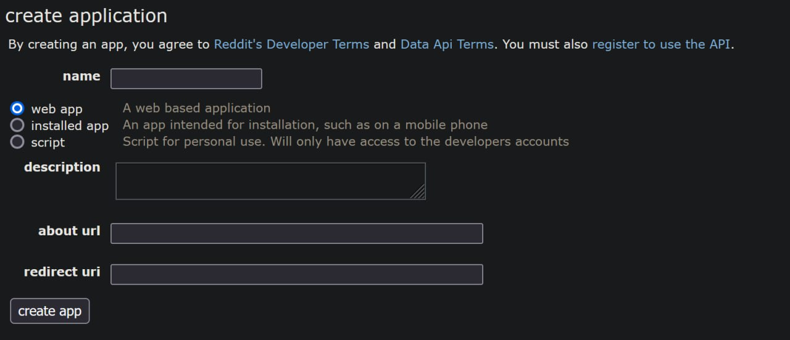

# UltraTTBot :rocket::robot:


## • Video Demo::

https://youtu.be/VCYIc41ThXU


This bot's abilities can be divided into 3 parts:

* Media downloader
* Blackjack with economy
* Admin helper tool


## • Media Downloader:

For the first part, you will be able to download media from those 3 platforms except Reddit without needing anything extra. You just provide the link to the bot and will get the video as the result. The API used for TikTok is made by Evil0ctal and can be found [here](https://github.com/Evil0ctal/Douyin_TikTok_Download_API/blob/main/scraper.py). But the rest of the project code was written by me completely.

For using the Reddit downloader, you would need to get a Reddit key by visiting [this page on Reddit](https://www.reddit.com/prefs/apps). Fill the `RedditKey` value in the **.env** file of the project with the key you get after registering for a new app on the mentioned URL.



Also fill the `RedditUser` and `RedditPass` too, which are your Reddit username and password respectively.

```.env
MONGODB_PWD = ''
MONGODB_URI = ''
RedditKey = ''
RedditUser = ''
RedditPass = ''
ClientID = ''
TTBotToken = ''
```
Database used in this project is MongoDB, make sure to connect your MongoDB by filling `MONGODB_PWD`, `MONGODB_URI` which 
are password and connection string respectively.

And ofcourse don't forget to get your bot's Token from [BotFather](https://t.me/BotFather).

Feel free to send links from all three platforms and see how the bot responds/handles them.

*Use the /help_media command in the bot for more information.*

## • BlackJack and Economy:

BlackJack is a famous card game which you can try with your friends in groups using this bot. [game rules](https://www.officialgamerules.org/blackjack).

By playing each game with your bot, you will either lose or gain money. You can see your placement among other group members in chat and send and receive money from your friends. Ran out of money? Don't worry, you can always get some more every hour by using the /collect command.

Deposit your money and play with your cash in hand in order to get richer and avoid getting broke. Word of advice? Don't get greedy!

*Use the /help_game command in the bot for more information.*

## • A Handy Tool for Admins:

There are some extra functionalities with users that are introduced as admins to the bot. Those functionalities are accessible for anyone who uses this project, and bot_admin filter was commented out for the sake of this project. But of course, you can uncomment them and test them as you wish.

There are lots of functionalities this bot provides for channel admins including watermarking videos, checking channel membership of bot users, trimming videos, sending media to the audience with a time limit, and some more.

**Be sure to add your telegrm user id which you can obtain by /myid command in the bot as the value for SUPER_USER variable [here](https://github.com/Pedram-Naghib/Telegram-Downloader-Game-Tool/blob/9239d1dbd8fbc909d61bea77a310eeada98ec879/src/constants.py#L18)!**

*Use the /help_admin command in the bot for more information.*